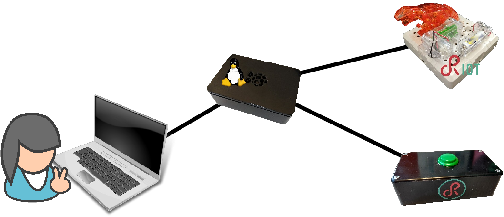

Lightning Talk Demo -- RIOT @ Jugend hackt, Oktober 2018
========================================================

Dies ist die Demo, die Martine beim Jugend hackt während ihres Lightning Talks
vorgeführt hat. Die Demo wurde für das [Atmel SAMR21 Xplained Pro] board
geschrieben, kann aber leicht für andere Boards portiert werden (solange diese
ein [IEEE 802.15.4]-kompadibles Radio haben), indem die jeweiligen GPIO-Pins
(`BUTTON_PIN` für die [`button`-Applikation][button], `DINO_MOVE_PIN` für die
[`dino`-Applikation][dino]) umdefiniert werden.

Die Demo hat folgenden Aufbau:

RIOT-seitig besteht die Demo aus zwei Applikationen:

* [button], die einen Internet-fähiger Knopf ist und
* [dino], die einen Internet-angesteuerter, motorisierter Dinosaurier darstellt
  (es können aber auch beliebige andere binäre Aktuatoren verwendet werden, wie
  z.B.  eine LED)

Außerdem gibt es noch einen Raspberry Pi, der über ein LAN-Kabel (oder wenn
eingerichtet über WLAN) mit dem Laptop des Benutzers verbunden ist, als ein
[Border Router] mit einem IEEE 802.15.4-fähigen Radio als "Hat" eingerichtet ist
und sich dem Laptop des Benutzers als IPv6-Gateway bewirbt. Außerdem, sollte ein
CoRE-RD-Server wie z. B. [aiocoap-rd] auf dem Raspberry Pi installiert sein.

Der Benutzer kann nun die `/resources/lookup`-Resource des CoRE-RD-Servers
abfragen, um die URLs des Dinos und des Knopfs zu bekommen. Der Button kann
programmiert werden in dem eine POST-Anfrage an seine Resource gemacht wird,
die ein JSON-Objekt mit der Adresse `addr` und dem Pfad `pfad` der zu steuernden
Resource enthält.

[Atmel SAMR21 Xplained Pro]: http://doc.riot-os.org/group__boards__samr21-xpro.html
[IEEE 802.15.4]: http://doc.riot-os.org/group__net__ieee802154.html
[button]: ./button
[dino]: ./dino
[Border Router]: https://github.com/RIOT-Makers/wpan-raspbian/wiki/Setup-native-6LoWPAN-router-using-Raspbian-and-RADVD
[IPv6 Gateway]: https://www.elektronik-kompendium.de/sites/raspberry-pi/1912201.htm
[aiocoap-rd]: https://aiocoap.readthedocs.io/en/latest/module/aiocoap.cli.rd.html
